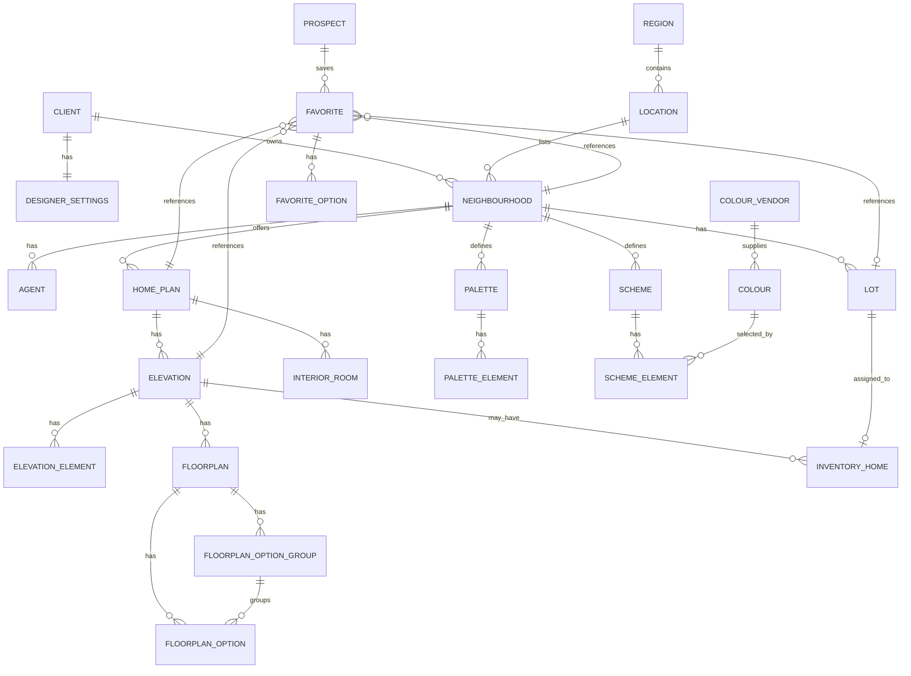

# Data Model

Status: inferred from frontend constructors and comparable recovered Rendering House responses.

## Entities

- `clients`: builder/customer identity, asset directory, website, contact fields, feature flags.
- `designer_settings`: per-client UI/navigation settings such as `pageOrder`, brochure options, labels, CRM config, color-storage provider.
- `regions`: high-level region/metro grouping used by filters and location guide.
- `locations`: city/metro-level groupings containing neighborhoods.
- `neighbourhoods`: communities with pricing flag, sorting mode, color method, agents, lots, plans, palettes, schemes, and standard features.
- `agents`: contact records attached to neighborhoods.
- `lots`: siteplan lots with geometry, status, elevation exclusions, optional land listing fields, optional linked inventory home.
- `home_plans`: plan families within neighborhoods.
- `elevations`: plan variants with beds, baths, sqft, cars, base price, thumbnails, color schemes, floorplan options, inventory homes.
- `inventory_homes`: quick move-in/listing records tied to lots and optionally elevations.
- `colour_vendors`: paint/material vendors.
- `colours`: vendor color records with hex values.
- `palettes`: selectable color/material layers.
- `schemes`: named packages composed of scheme elements and palette/color selections.
- `elevation_elements`: renderable image/color layers for an elevation.
- `floorplans`: per-elevation floor records.
- `floorplan_option_groups`: option group metadata and dependency groups.
- `floorplan_options`: structural options with cost, size delta, render order, image source, and optional alternate images.
- `interior_rooms`: interior design rooms attached to plans.
- `interior_elements`: selectable interior materials/options.
- `filter_categories` and `filter_tags`: additional plan/inventory filter metadata.
- `users/prospects`: sign-in and registration records.
- `favorites`: saved home selections, scheme colors, floorplan options, lots, and brochure state.

## Mermaid ERD

## Rebuild Notes

- The original app mixes XML for initial catalog data and JSON for lazy details.
- The model is client-first; `clientId` and neighborhood IDs are the central lookup keys.
- Pricing exists at elevation, lot, inventory, scheme, floorplan option, and architectural option levels.
- Availability is likely encoded in lot `sold` status and inventory `status`.
- Color/finish rendering is layer-based: palettes define render layers, schemes bind layers to colors or overlay selections.

