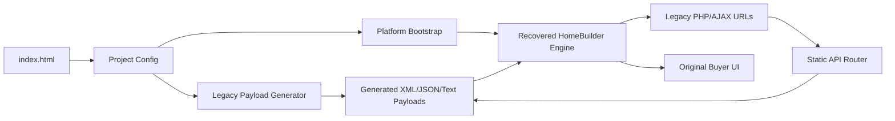

# Platform Architecture

Status: inferred from the recovered frontend and local reconstruction.

## Layer Map

### 1. Core Platform Engine

Reusable engine logic currently lives mostly inside the recovered minified bundle:

- `homedesigner/dist/js/homebuilder.min.js`
- `homedesigner/dist/js/foundation.min.js`
- `homedesigner/dist/css/app.css`
- `homedesigner/dist/css/homebuilder.min.css`
- vendor dependencies under `vendor/`
- map helpers under `ext/scripts/`

This layer owns the original buyer workflow, filtering, plan browsing, elevation display, floorplan option handling, favorites hooks, lead capture hooks, brochure/social hooks, and API parsing.

Modern extraction target: replace the minified bundle with readable modules while preserving its contracts.

### 2. Builder And Project Configuration

The new configuration entry point is:

- `app/config/upperview-project.config.js`

It defines the current builder, project, community, catalog, color package, option, workflow, and static API route settings. This is the first portable boundary for swapping UpperView/Grandview Trail out for another builder or community.

### 3. Community Data

The original frontend expects community data through legacy PHP-shaped responses:

- `data/generated/db/scripts/php/getsummary.generated.json`
- `data/generated/db/scripts/php/getnbrhoodsdata.generated.xml`

The normalized source-of-truth is now `config.communities`; the XML/JSON files are generated from it for legacy compatibility.

### 4. Plan And Elevation Data

The original frontend expects plan/elevation data through:

- `data/generated/db/scripts/php/getplans.generated.xml`
- `data/generated/db/scripts/php/getElevationDetails.generated.json`
- `data/generated/db/scripts/php/getElevationElements.generated.json`
- `data/generated/db/scripts/php/getElevationSchemes.generated.json`
- `data/generated/db/scripts/php/getPlanFloorplans.generated.json`

The new `config.catalog` describes the same domain in a more portable form. The generated XML/JSON files are the active compatibility payloads. The reconstructed XML/JSON files remain preserved as evidence and fallback fixtures.

### 5. UI Components

The recovered UI components are embedded in `homebuilder.min.js` and rendered into the original DOM shell in `index.html`.

Reusable UI concepts:

- splash/start page
- community selection
- plan list and filters
- plan/elevation selection
- exterior color/package flow
- floorplan/options flow
- favorites and lead capture modals
- brochure/share flows

Current limitation: components are not yet independently importable because they remain bundled/minified.

### 6. API Contracts

The legacy API surface is documented in:

- `API_CONTRACTS.md`
- `ENDPOINT_INVENTORY.md`

The local compatibility router is now reusable:

- `app/platform/static-api-router.js`
- `app/platform/legacy-payload-generator.js`

It routes old PHP/API calls to files listed in `HomePlannerConfig.api.routes`.

Generated payload mappings are documented in:

- `GENERATED_PAYLOAD_MAPPINGS.md`

### 7. Buyer Workflow State

The recovered app stores most workflow state internally in the legacy `anewgo.homedesign`, `anewgo.filters`, `anewgo.favorites`, `anewgo.nbrhoods`, `anewgo.plans`, `anewgo.elevation`, and `anewgo.planfp` modules.

The portable state model is now listed in `HomePlannerConfig.workflow.buyerStateKeys`:

- selected community
- selected plan
- selected elevation
- selected scheme/color package
- selected floorplan options
- selected lot
- lead profile
- favorites

Modern extraction target: move this state into a clear store with serializable snapshots and backend persistence.

## Current Runtime Flow

## Portability Boundary

Reusable platform layer:

- `app/platform/config-bootstrap.js`
- `app/platform/static-api-router.js`
- `app/platform/legacy-payload-generator.js`
- `scripts/generate-legacy-payloads.js`
- `tests/compatibility.test.js`
- recovered engine assets, until replaced
- API contracts
- normalized buyer workflow concepts

Project-specific layer:

- `app/config/upperview-project.config.js`
- `data/generated/*` generated UpperView/Grandview Trail compatibility payloads
- `data/reconstructed/*` preserved UpperView/Grandview Trail fallback/evidence payloads
- `app/upperview/*` placeholder image assets
- stage defaults in `index.html`

## Next Extraction Steps

1. Expand the normalized config to cover lots, richer plan catalogs, real assets, and late-flow endpoints.
2. Split the minified recovered bundle into readable modules or rebuild the modules against the documented contracts.
3. Add a real state store for the buyer workflow.
4. Replace static generated payload files with a backend or local JSON data service.
5. Keep a compatibility adapter so archived frontend flows can still be regression-tested.
